# azure-terraform-public-private-zone

## Pre-requisite
- Terraform v1.15.6 
- Azure CLI
- openssl (self-signed PFX certificate and connect group of VM)

## Architecture flow overview
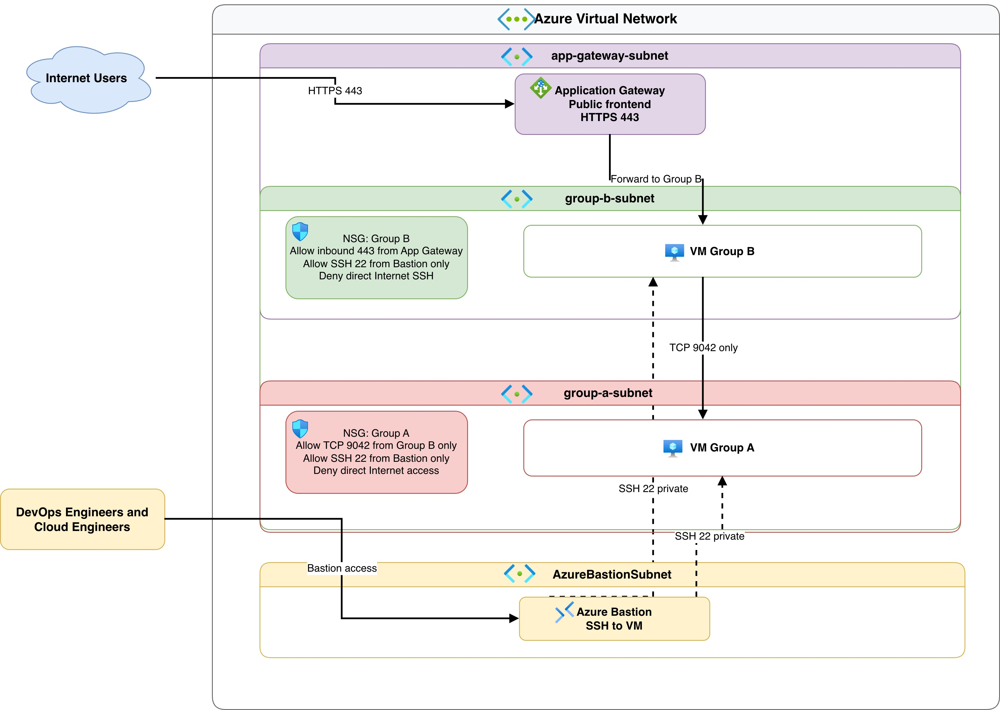

## How to work
## NOTE! Sometims Quotas of Azure Virtual Machine size might be facing limit. Check out the official website at [Azure](https://learn.microsoft.com/en-us/azure/aks/quotas-skus-regions).


Predefined terraform.tfvars variable
```
# Azure Subcription 
subscription_id = "0000-000-0000-0000-00000"
tenant_id       = "0000-000-0000-0000-00000"

# Username and publickey for Azure Bastion ssh. 
admin_username = "azureuser" 
admin_ssh_public_keys = [
  "ssh-rsa AAAAB3....",
]

# Password for Azure Application gateway self-signed certificate 
app_gateway_ssl_certificate_password = "Changeit!"
```

Predefined Azure environment variable
```
ARM_SUBSCRIPTION_ID="0000-000-0000-0000-00000"
ARM_TENANT_ID="0000-000-0000-0000-00000"
ARM_CLIENT_ID="0000-000-0000-0000-00000"
ARM_CLIENT_SECRET="0000-000-0000-0000-00000"
```

## Local Command
Predefined to add Azure CLI extension
```
$ az extension add --name bastion

$ az extension add -n ssh
```

Basic to run Terrafrom to provisioning Azure Resources.
```
# Prepare working directory
$ terraform init 

# Show the current state or a saved plan
$ terraform show

# Show changes required by the current configuration
$ terraform plan

# Create or update infrastructure
$ terraform apply

# Destroy previously-created infrastructure
$ terraform destroy
```

Example command to use Bastion connect to Virtua Machines.
```
# Set Azure CLI
$ az account set --subscription $subscription_id

# Verify bastion
$ az extension show --name bastion --output table

# Verify configured key matches
$ cat ~/.ssh/id_rsa
$ cat ~/.ssh/id_rsa.pub
$ chmod 600 ~/.ssh/id_rsa

# connect to Group A
$ az network bastion ssh \
  --name bas-terraform-public-private-zone \
  --resource-group rg-terraform-public-private-zone \
  --target-resource-id "/subscriptions/4297c6b5-ecbd-4930-ad13-3f7e44822812/resourceGroups/rg-terraform-public-private-zone/providers/Microsoft.Compute/virtualMachines/terraform-public-private-zone-group-a-vm-1" \
  --auth-type ssh-key \
  --username azureuser \
  --ssh-key ~/.ssh/id_rsa

# Connect to Group B
$ az network bastion ssh \
  --name bas-terraform-public-private-zone \
  --resource-group rg-terraform-public-private-zone \
  --target-resource-id "/subscriptions/4297c6b5-ecbd-4930-ad13-3f7e44822812/resourceGroups/rg-terraform-public-private-zone/providers/Microsoft.Compute/virtualMachines/terraform-public-private-zone-group-b-vm-1" \
  --auth-type ssh-key \
  --username azureuser \
  --ssh-key ~/.ssh/id_rsa
```

## Result
### Terraform apply success.
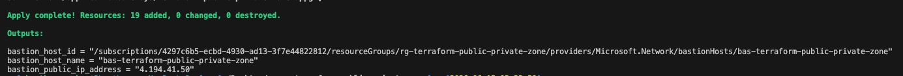

### Resources group
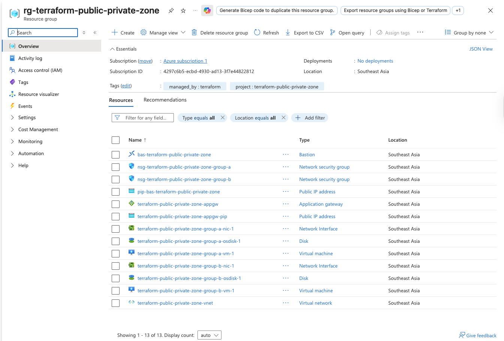

### Virtual networks
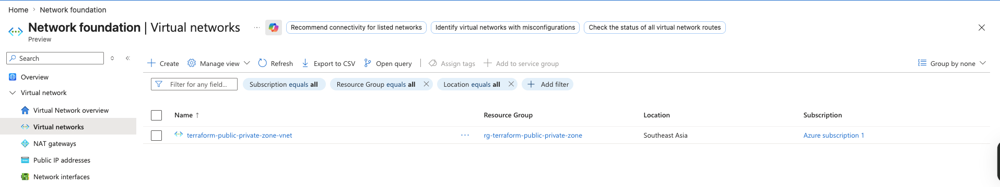

### Subnets
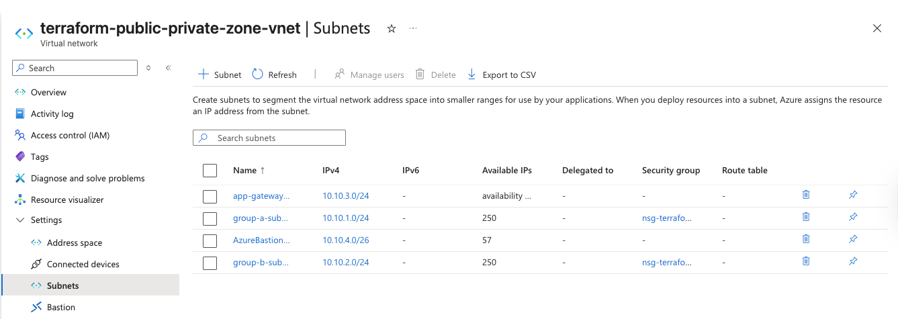

### Network security groups
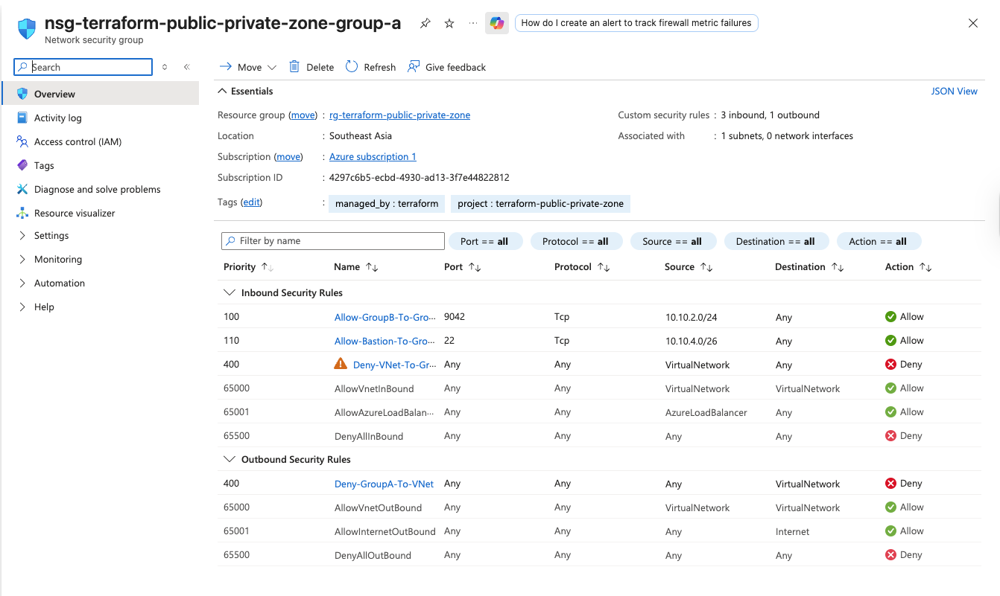
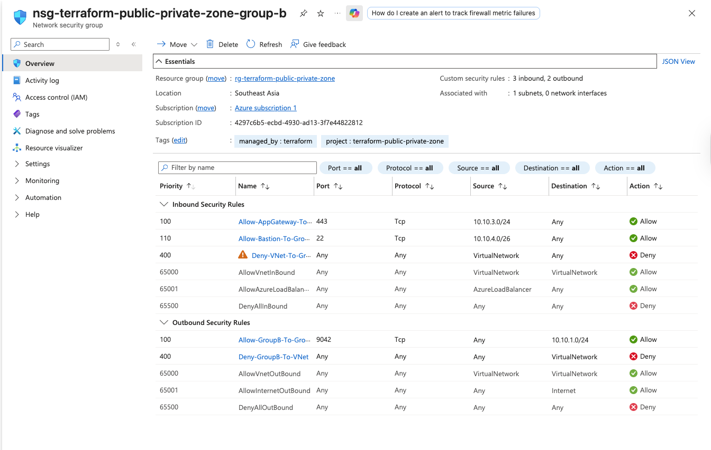

### Application gateway
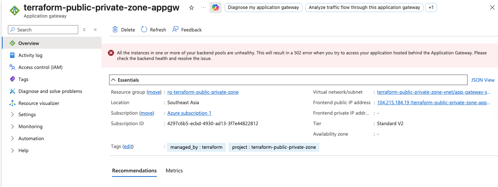

### Virtua Machines
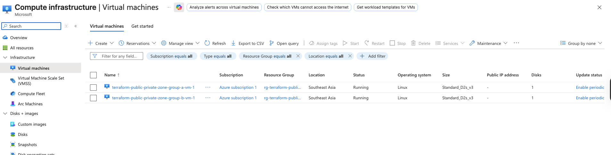
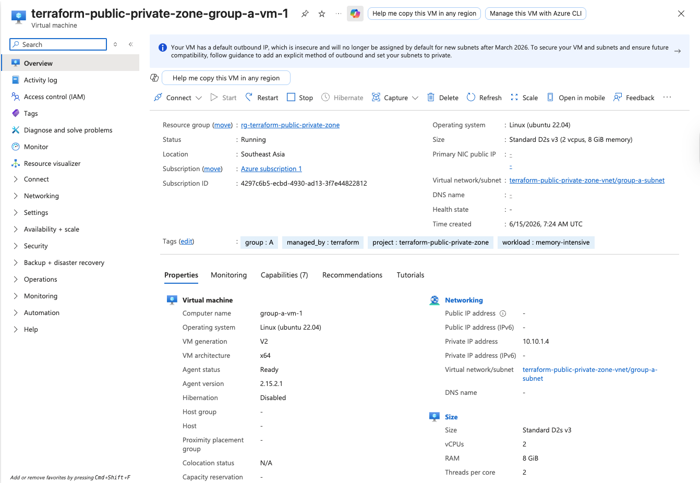
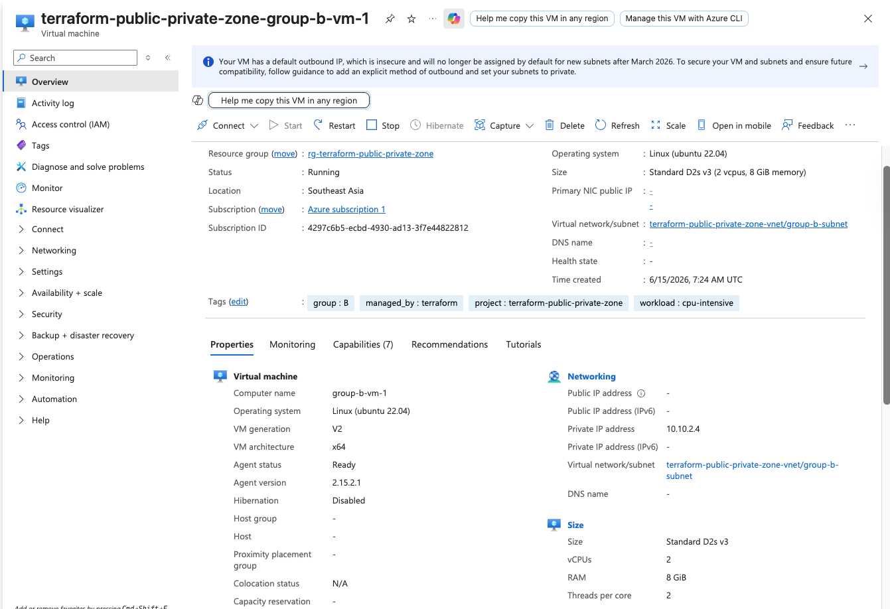

### Bastion
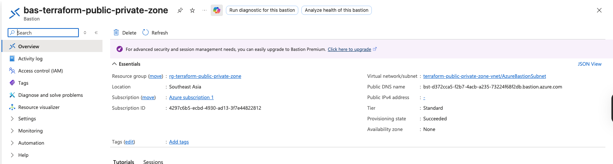

### Use Bastion connect to Virtua Machines Group A
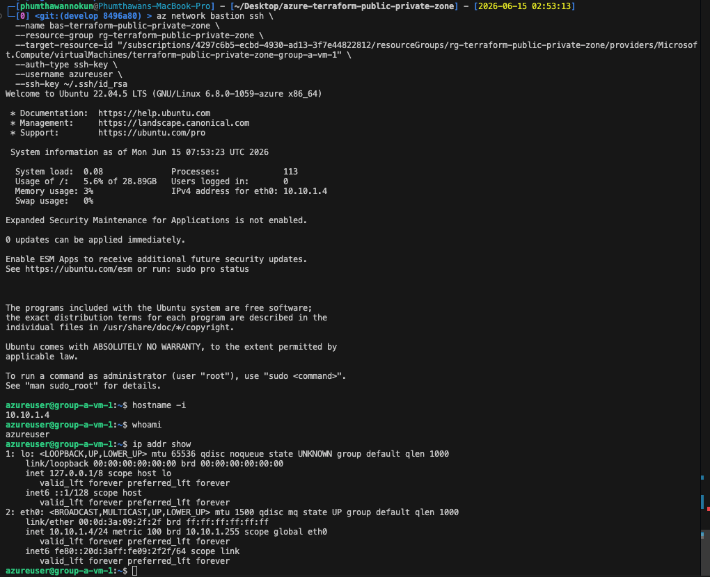

### Use Bastion connect to Virtua Machines Group B
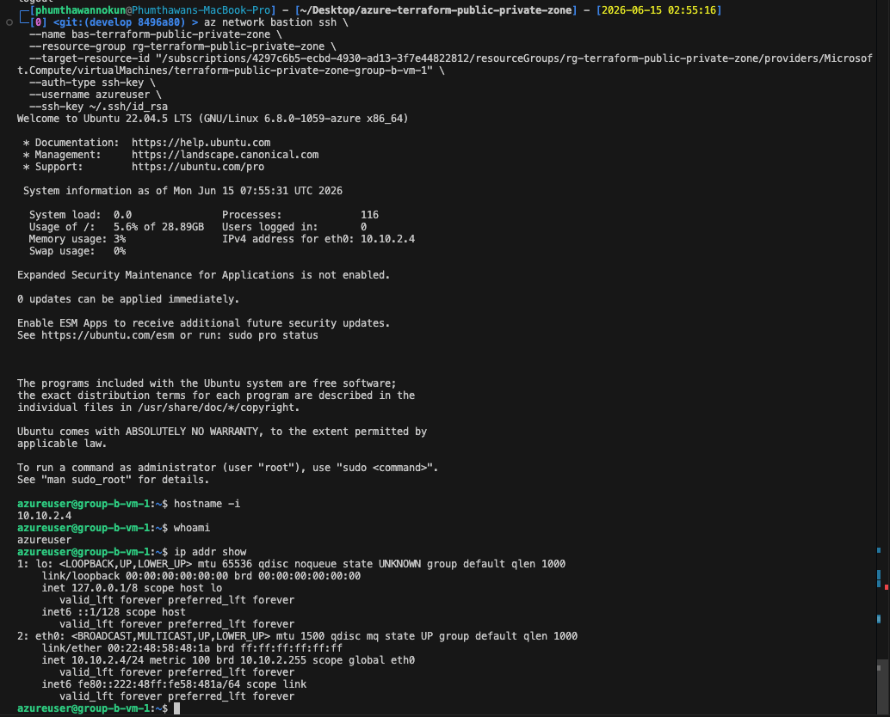
